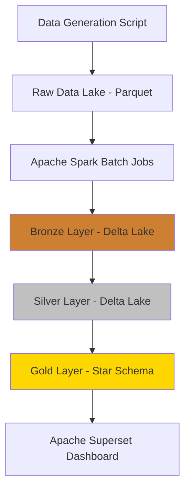

# Personal Finance Data Platform - Apache Spark 배치 처리 프로젝트

> **학습 목표**: Apache Spark를 활용한 배치 데이터 파이프라인 구축, Medallion Architecture 실습, Star Schema 기반 데이터 마트 설계

---

## 1. 기술 스택 및 아키텍처 선정 근거

### 1.1 Apache Spark 선택 이유 (데이터 엔지니어링 관점)

| 요구사항 | Spark 적합성 | 이유 |
|---------|------------|------|
| 배치 처리 | ✅ 최적 | 대용량 배치 처리의 사실상 표준 |
| 학습 목적 | ✅ 최적 | 현업에서 가장 많이 사용되는 분산 처리 프레임워크 |
| 데이터 변환 | ✅ 최적 | DataFrame API로 복잡한 ETL 로직 구현 용이 |
| 확장성 | ✅ 최적 | 로컬 → 클러스터 전환 가능 |

### 1.2 최신 기술 스택 (2024-2025)



**핵심 기술**:
- **데이터 처리**: Apache Spark 3.5+ (PySpark)
- **스토리지 포맷**: Delta Lake (ACID 트랜잭션, 타임 트래블)
- **데이터 생성**: Faker 라이브러리 기반 스크립트
- **오케스트레이션**: Apache Airflow (선택)
- **시각화**: Apache Superset 또는 Metabase
- **메타데이터**: Hive Metastore (선택)

### 1.3 Medallion Architecture - 여전히 트렌디한가?

**답: YES! 2024년 현재도 업계 표준** ✅

- **Databricks**: 공식 권장 아키텍처
- **Snowflake**: Multi-tier 아키텍처로 동일 개념 사용
- **AWS Lake Formation**: Bronze/Silver/Gold 레이어 지원
- **Azure Synapse**: Medallion 패턴 공식 문서화

**최신 트렌드 추가**:
- Delta Lake로 각 레이어 구현 (ACID, Schema Evolution)
- Data Quality 체크 자동화 (Great Expectations)
- Lakehouse 아키텍처 (Data Warehouse + Data Lake)

---

## 2. 데이터 생성 전략

### 2.1 CSV vs 스크립트 기반 생성

| 방식 | 장점 | 단점 | 선택 |
|-----|------|------|------|
| CSV 파일 | 간단, 실제 데이터 형태 | 확장 어려움, 수동 작업 | ❌ |
| Python 스크립트 | 자동화, 대용량 생성 가능, 재현 가능 | 초기 구현 필요 | ✅ **추천** |

### 2.2 데이터 생성 스크립트 설계

```python
# data_generator/transaction_generator.py
from faker import Faker
import pandas as pd
from datetime import datetime, timedelta
import random

class TransactionGenerator:
    def __init__(self, seed=42):
        self.fake = Faker('ko_KR')
        Faker.seed(seed)
        random.seed(seed)
    
    def generate_card_transactions(self, num_records=100000, 
                                   start_date='2023-01-01', 
                                   end_date='2024-12-31'):
        """카드 거래 데이터 생성 (10만건 기본)"""
        
        merchants = self._load_merchant_catalog()
        
        data = []
        for _ in range(num_records):
            merchant = random.choice(merchants)
            txn_date = self.fake.date_between(
                start_date=datetime.strptime(start_date, '%Y-%m-%d'),
                end_date=datetime.strptime(end_date, '%Y-%m-%d')
            )
            
            data.append({
                'transaction_id': self.fake.uuid4(),
                'transaction_date': txn_date,
                'merchant_name': merchant['name'],
                'merchant_category': merchant['category'],  # 정답 레이블
                'amount': random.randint(1000, 500000),
                'card_number': f"****{random.randint(1000, 9999)}",
                'created_at': datetime.now()
            })
        
        return pd.DataFrame(data)
    
    def _load_merchant_catalog(self):
        """실제 상호명 카탈로그"""
        return [
            {'name': '스타벅스 강남점', 'category': '식비-카페'},
            {'name': '이마트 월계점', 'category': '식비-마트'},
            {'name': 'CGV 용산', 'category': '문화-영화'},
            # ... 100개 이상의 상호명
        ]
```

**생성 데이터 규모**:
- 카드 거래: 100,000건 (2년치)
- 은행 입출금: 50,000건
- 주식 거래: 10,000건
- 적금: 100건

---

## 3. Star Schema 기반 데이터 마트 설계

### 3.1 Star Schema 개념

```
        ┌─────────────┐
        │ dim_date    │
        └──────┬──────┘
               │
        ┌──────▼──────┐
        │ dim_merchant│
        └──────┬──────┘
               │
    ┌──────────▼──────────────┐
    │  fact_transactions      │ ◄─── Fact Table (중심)
    └──────────┬──────────────┘
               │
        ┌──────▼──────┐
        │ dim_category│
        └──────┬──────┘
               │
        ┌──────▼──────┐
        │ dim_card    │
        └─────────────┘
```

### 3.2 Fact Table 설계

#### `fact_transactions` (사실 테이블)

```sql
CREATE TABLE gold.fact_transactions (
    -- Surrogate Key
    transaction_key BIGINT PRIMARY KEY,
    
    -- Foreign Keys (Dimension 연결)
    date_key INT NOT NULL,
    merchant_key INT NOT NULL,
    category_key INT NOT NULL,
    card_key INT NOT NULL,
    
    -- Degenerate Dimensions (Fact에만 존재)
    transaction_id STRING,
    
    -- Measures (집계 대상)
    amount DECIMAL(15,2) NOT NULL,
    quantity INT DEFAULT 1,
    
    -- Metadata
    created_at TIMESTAMP,
    updated_at TIMESTAMP
)
USING DELTA
PARTITIONED BY (date_key);
```

### 3.3 Dimension Tables 설계

#### `dim_date` (날짜 차원)

```sql
CREATE TABLE gold.dim_date (
    date_key INT PRIMARY KEY,  -- 20240101
    full_date DATE NOT NULL,
    year INT,
    quarter INT,
    month INT,
    month_name STRING,
    day_of_month INT,
    day_of_week INT,
    day_name STRING,
    is_weekend BOOLEAN,
    is_holiday BOOLEAN,
    fiscal_year INT,
    fiscal_quarter INT
)
USING DELTA;
```

#### `dim_merchant` (상점 차원)

```sql
CREATE TABLE gold.dim_merchant (
    merchant_key INT PRIMARY KEY,
    merchant_id STRING,
    merchant_name STRING,
    normalized_name STRING,
    merchant_type STRING,
    location STRING,
    -- SCD Type 2 (천천히 변하는 차원)
    effective_date DATE,
    expiration_date DATE,
    is_current BOOLEAN
)
USING DELTA;
```

#### `dim_category` (카테고리 차원)

```sql
CREATE TABLE gold.dim_category (
    category_key INT PRIMARY KEY,
    category_id STRING,
    category_name STRING,
    subcategory_name STRING,
    category_group STRING,
    -- Hierarchy
    level_1 STRING,  -- 대분류: 식비
    level_2 STRING,  -- 중분류: 외식
    level_3 STRING   -- 소분류: 카페
)
USING DELTA;
```

#### `dim_card` (카드 차원)

```sql
CREATE TABLE gold.dim_card (
    card_key INT PRIMARY KEY,
    card_number_masked STRING,
    card_type STRING,  -- 신용/체크
    card_company STRING,
    issue_date DATE
)
USING DELTA;
```

### 3.4 Star Schema의 장점

| 장점 | 설명 |
|-----|------|
| **쿼리 성능** | 조인 최소화 (Fact ↔ Dim만) |
| **이해 용이** | 비즈니스 사용자도 이해 가능 |
| **집계 최적화** | BI 도구 최적화 |
| **확장성** | Dimension 독립적 확장 |

---

## 4. Medallion Architecture 구현

### 4.1 Bronze Layer (Raw Data)

**목적**: 원본 데이터 그대로 저장 (Immutable)

```python
# jobs/bronze_ingestion.py
from pyspark.sql import SparkSession

def ingest_to_bronze(spark, source_path, table_name):
    """
    Parquet 파일을 Delta Lake Bronze로 적재
    """
    df = spark.read.parquet(source_path)
    
    # 메타데이터 추가
    df_with_meta = df \
        .withColumn("ingestion_timestamp", current_timestamp()) \
        .withColumn("source_file", input_file_name())
    
    # Delta Lake에 저장 (Append Only)
    df_with_meta.write \
        .format("delta") \
        .mode("append") \
        .option("mergeSchema", "true") \
        .save(f"/data/bronze/{table_name}")
```

**스키마**:
```python
bronze_card_schema = StructType([
    StructField("transaction_id", StringType(), False),
    StructField("transaction_date", DateType(), False),
    StructField("merchant_name", StringType(), False),
    StructField("amount", DecimalType(15,2), False),
    StructField("card_number", StringType(), True),
    StructField("ingestion_timestamp", TimestampType(), False),
    StructField("source_file", StringType(), True)
])
```

### 4.2 Silver Layer (Cleaned & Validated)

**목적**: 데이터 품질 검증, 정제, 중복 제거

```python
# jobs/silver_transformation.py
from pyspark.sql.functions import *
from delta.tables import DeltaTable

def transform_to_silver(spark, bronze_path, silver_path):
    """
    Bronze → Silver 변환
    - 중복 제거
    - 데이터 검증
    - 정규화
    """
    df_bronze = spark.read.format("delta").load(bronze_path)
    
    # 1. 중복 제거 (transaction_id 기준)
    df_dedup = df_bronze.dropDuplicates(["transaction_id"])
    
    # 2. 데이터 검증
    df_validated = df_dedup.filter(
        (col("amount") > 0) &
        (col("transaction_date").isNotNull()) &
        (col("merchant_name").isNotNull())
    )
    
    # 3. 상호명 정규화
    df_normalized = df_validated.withColumn(
        "normalized_merchant",
        normalize_merchant_udf(col("merchant_name"))
    )
    
    # 4. 거래 유형 분류
    df_typed = df_normalized.withColumn(
        "transaction_type",
        when(col("amount") > 0, "INCOME")
        .otherwise("EXPENSE")
    )
    
    # 5. Delta Lake Merge (Upsert)
    if DeltaTable.isDeltaTable(spark, silver_path):
        delta_table = DeltaTable.forPath(spark, silver_path)
        delta_table.alias("target").merge(
            df_typed.alias("source"),
            "target.transaction_id = source.transaction_id"
        ).whenMatchedUpdateAll() \
         .whenNotMatchedInsertAll() \
         .execute()
    else:
        df_typed.write.format("delta").save(silver_path)
```

**Data Quality 체크**:
```python
# utils/data_quality.py
from great_expectations.dataset import SparkDFDataset

def validate_silver_data(df):
    """Great Expectations로 데이터 품질 검증"""
    ge_df = SparkDFDataset(df)
    
    # 검증 규칙
    ge_df.expect_column_values_to_not_be_null("transaction_id")
    ge_df.expect_column_values_to_be_unique("transaction_id")
    ge_df.expect_column_values_to_be_between("amount", 0, 10000000)
    ge_df.expect_column_values_to_be_of_type("transaction_date", "DateType")
    
    results = ge_df.validate()
    return results.success
```

### 4.3 Gold Layer (Star Schema Data Mart)

**목적**: 비즈니스 분석을 위한 최적화된 데이터 마트

```python
# jobs/gold_star_schema.py

def build_fact_table(spark, silver_path):
    """
    Silver → Gold Fact Table 생성
    """
    df_silver = spark.read.format("delta").load(silver_path)
    
    # Dimension 테이블 조회
    dim_date = spark.read.format("delta").load("/data/gold/dim_date")
    dim_merchant = spark.read.format("delta").load("/data/gold/dim_merchant")
    dim_category = spark.read.format("delta").load("/data/gold/dim_category")
    dim_card = spark.read.format("delta").load("/data/gold/dim_card")
    
    # Fact 테이블 생성 (Surrogate Key 조인)
    fact_df = df_silver \
        .join(dim_date, 
              to_date(df_silver.transaction_date) == dim_date.full_date) \
        .join(dim_merchant.filter(col("is_current") == True),
              df_silver.normalized_merchant == dim_merchant.normalized_name) \
        .join(dim_category,
              df_silver.category == dim_category.category_name) \
        .join(dim_card,
              df_silver.card_number == dim_card.card_number_masked) \
        .select(
            monotonically_increasing_id().alias("transaction_key"),
            dim_date.date_key,
            dim_merchant.merchant_key,
            dim_category.category_key,
            dim_card.card_key,
            df_silver.transaction_id,
            df_silver.amount,
            current_timestamp().alias("created_at")
        )
    
    # Delta Lake에 저장 (Partitioned by date_key)
    fact_df.write \
        .format("delta") \
        .mode("overwrite") \
        .partitionBy("date_key") \
        .save("/data/gold/fact_transactions")
```

**Dimension 테이블 생성**:
```python
def build_dim_date(spark, start_date, end_date):
    """날짜 차원 테이블 생성"""
    from datetime import datetime, timedelta
    
    dates = []
    current = datetime.strptime(start_date, '%Y-%m-%d')
    end = datetime.strptime(end_date, '%Y-%m-%d')
    
    while current <= end:
        dates.append({
            'date_key': int(current.strftime('%Y%m%d')),
            'full_date': current.date(),
            'year': current.year,
            'quarter': (current.month - 1) // 3 + 1,
            'month': current.month,
            'month_name': current.strftime('%B'),
            'day_of_month': current.day,
            'day_of_week': current.weekday(),
            'day_name': current.strftime('%A'),
            'is_weekend': current.weekday() >= 5,
            'is_holiday': check_holiday(current)  # 공휴일 체크 로직
        })
        current += timedelta(days=1)
    
    df = spark.createDataFrame(dates)
    df.write.format("delta").mode("overwrite").save("/data/gold/dim_date")
```

---

## 5. 프로젝트 구조

```
finance-spark-platform/
├── data/
│   ├── raw/                       # 생성된 Parquet 파일
│   ├── bronze/                    # Delta Lake Bronze
│   ├── silver/                    # Delta Lake Silver
│   └── gold/                      # Delta Lake Gold (Star Schema)
│
├── data_generator/                # 데이터 생성 스크립트
│   ├── __init__.py
│   ├── transaction_generator.py
│   ├── merchant_catalog.yaml
│   └── generate_all.py
│
├── jobs/                          # Spark Job 스크립트
│   ├── bronze_ingestion.py
│   ├── silver_transformation.py
│   ├── gold_star_schema.py
│   └── categorization_job.py
│
├── schemas/                       # 스키마 정의
│   ├── bronze_schemas.py
│   ├── silver_schemas.py
│   └── gold_schemas.py
│
├── utils/                         # 유틸리티
│   ├── spark_session.py
│   ├── data_quality.py
│   └── logger.py
│
├── airflow/                       # Airflow DAGs (선택)
│   └── dags/
│       └── daily_etl_pipeline.py
│
├── sql/                           # SQL 쿼리
│   ├── create_dimensions.sql
│   └── analytics_queries.sql
│
├── notebooks/                     # Jupyter 노트북
│   ├── 01_data_exploration.ipynb
│   ├── 02_etl_development.ipynb
│   └── 03_analytics.ipynb
│
├── tests/
│   ├── test_transformations.py
│   └── test_data_quality.py
│
├── configs/
│   ├── spark_config.yaml
│   └── pipeline_config.yaml
│
├── docs/
│   └── roadmap.md
│
├── pyproject.toml
└── README.md
```

---

## 6. 핵심 코드 구현

### 6.1 Spark Session 설정

```python
# utils/spark_session.py
from pyspark.sql import SparkSession

def create_spark_session(app_name="FinanceDataPlatform"):
    """
    Delta Lake 지원 Spark Session 생성
    """
    spark = SparkSession.builder \
        .appName(app_name) \
        .config("spark.sql.extensions", "io.delta.sql.DeltaSparkSessionExtension") \
        .config("spark.sql.catalog.spark_catalog", "org.apache.spark.sql.delta.catalog.DeltaCatalog") \
        .config("spark.sql.adaptive.enabled", "true") \
        .config("spark.sql.adaptive.coalescePartitions.enabled", "true") \
        .config("spark.databricks.delta.retentionDurationCheck.enabled", "false") \
        .master("local[*]") \
        .getOrCreate()
    
    spark.sparkContext.setLogLevel("WARN")
    return spark
```

### 6.2 전체 파이프라인 오케스트레이션

```python
# jobs/run_pipeline.py
from utils.spark_session import create_spark_session
from jobs.bronze_ingestion import ingest_to_bronze
from jobs.silver_transformation import transform_to_silver
from jobs.gold_star_schema import build_fact_table, build_dimensions

def run_full_pipeline():
    """전체 ETL 파이프라인 실행"""
    spark = create_spark_session()
    
    try:
        # Step 1: Bronze Ingestion
        print("🔶 Bronze Layer 적재 시작...")
        ingest_to_bronze(spark, "/data/raw/card_transactions.parquet", "card_transactions")
        
        # Step 2: Silver Transformation
        print("🔷 Silver Layer 변환 시작...")
        transform_to_silver(spark, "/data/bronze/card_transactions", "/data/silver/transactions")
        
        # Step 3: Build Dimensions
        print("🌟 Dimension 테이블 생성...")
        build_dimensions(spark)
        
        # Step 4: Build Fact Table
        print("🌟 Fact 테이블 생성...")
        build_fact_table(spark, "/data/silver/transactions")
        
        print("✅ 파이프라인 완료!")
        
    except Exception as e:
        print(f"❌ 파이프라인 실패: {e}")
        raise
    finally:
        spark.stop()

if __name__ == "__main__":
    run_full_pipeline()
```

### 6.3 분석 쿼리 예시

```python
# analytics/monthly_report.py

def generate_monthly_report(spark, year_month):
    """
    Star Schema를 활용한 월별 리포트
    """
    query = f"""
    SELECT 
        d.month_name,
        c.category_name,
        c.subcategory_name,
        COUNT(*) as transaction_count,
        SUM(f.amount) as total_amount,
        AVG(f.amount) as avg_amount,
        MAX(f.amount) as max_amount
    FROM gold.fact_transactions f
    JOIN gold.dim_date d ON f.date_key = d.date_key
    JOIN gold.dim_category c ON f.category_key = c.category_key
    WHERE d.year = {year_month[:4]}
      AND d.month = {int(year_month[5:])}
    GROUP BY d.month_name, c.category_name, c.subcategory_name
    ORDER BY total_amount DESC
    """
    
    return spark.sql(query)
```

---

## 7. 2주 개발 타임라인

### Week 1: 데이터 생성 및 Bronze/Silver 구축 ✅ COMPLETED

#### Day 1-2: 환경 설정 및 데이터 생성
- [x] Spark 3.5 + Delta Lake 설치
- [x] 데이터 생성 스크립트 작성 (Faker 기반)
- [x] 10만건 카드 거래 데이터 생성 (Parquet)
- [x] 상호명 카탈로그 40개 작성

#### Day 3-4: Bronze Layer
- [x] Bronze 스키마 정의
- [x] Parquet → Delta Lake 적재 Job
- [x] 메타데이터 추가 로직
- [x] Spark-Parquet 호환성 수정

#### Day 5-7: Silver Layer
- [x] 데이터 정제 로직 (중복 제거, 검증)
- [x] 상호명 정규화 UDF
- [x] Delta Lake Merge (Upsert) 구현
- [x] 데이터 품질 검증 로직

### Week 2: Gold Layer (Star Schema) 및 분석 🔄 IN PROGRESS

#### Day 8-10: Dimension Tables
- [x] `dim_date` 생성 (2년치, 731일)
- [x] `dim_merchant` 생성 (41개 상점)
- [x] `dim_category` 생성 (18개 카테고리, 계층 구조)
- [ ] `dim_card` 생성 (선택사항)

#### Day 11-12: Fact Table
- [x] `fact_transactions` 생성
- [x] Surrogate Key 조인 로직
- [x] Partitioning 최적화 (date_key)
- [ ] 성능 테스트 및 벤치마크

#### Day 13-14: 분석 및 시각화 ⏳ NEXT
- [ ] 월별/카테고리별 집계 쿼리
- [ ] Jupyter Notebook 분석
- [ ] 데이터 시각화 (matplotlib, seaborn)
- [ ] 문서화 및 정리

---

## 8. 분석 쿼리 예시 (Star Schema 활용)

### 8.1 월별 카테고리 지출 분석

```sql
SELECT 
    d.year,
    d.month_name,
    c.level_1 as main_category,
    SUM(f.amount) as total_spent,
    COUNT(*) as transaction_count
FROM gold.fact_transactions f
JOIN gold.dim_date d ON f.date_key = d.date_key
JOIN gold.dim_category c ON f.category_key = c.category_key
WHERE d.year = 2024
GROUP BY d.year, d.month_name, c.level_1
ORDER BY d.month, total_spent DESC;
```

### 8.2 주말 vs 평일 소비 패턴

```sql
SELECT 
    d.is_weekend,
    c.category_name,
    AVG(f.amount) as avg_amount,
    COUNT(*) as txn_count
FROM gold.fact_transactions f
JOIN gold.dim_date d ON f.date_key = d.date_key
JOIN gold.dim_category c ON f.category_key = c.category_key
GROUP BY d.is_weekend, c.category_name
ORDER BY avg_amount DESC;
```

### 8.3 Top 10 상점 분석

```sql
SELECT 
    m.merchant_name,
    c.category_name,
    SUM(f.amount) as total_spent,
    COUNT(*) as visit_count
FROM gold.fact_transactions f
JOIN gold.dim_merchant m ON f.merchant_key = m.merchant_key
JOIN gold.dim_category c ON f.category_key = c.category_key
WHERE m.is_current = true
GROUP BY m.merchant_name, c.category_name
ORDER BY total_spent DESC
LIMIT 10;
```

---

## 9. Delta Lake 고급 기능 활용

### 9.1 Time Travel (데이터 버전 관리)

```python
# 특정 시점 데이터 조회
df_yesterday = spark.read \
    .format("delta") \
    .option("versionAsOf", 1) \
    .load("/data/silver/transactions")

# 특정 타임스탬프 데이터 조회
df_snapshot = spark.read \
    .format("delta") \
    .option("timestampAsOf", "2024-01-01") \
    .load("/data/silver/transactions")
```

### 9.2 VACUUM (오래된 파일 정리)

```python
from delta.tables import DeltaTable

delta_table = DeltaTable.forPath(spark, "/data/silver/transactions")
delta_table.vacuum(168)  # 7일 이상 된 파일 삭제
```

### 9.3 OPTIMIZE (파일 압축)

```python
# 작은 파일들을 큰 파일로 병합
spark.sql("OPTIMIZE delta.`/data/gold/fact_transactions` ZORDER BY (date_key)")
```

---

## 10. 실행 가이드

### 10.1 초기 설정 (uv 사용)

```bash
# 1. uv 설치 (macOS)
curl -LsSf https://astral.sh/uv/install.sh | sh

# 2. 프로젝트 초기화
uv init finance-spark-platform
cd finance-spark-platform

# 3. Python 3.11 설치 및 가상환경 생성
uv python install 3.11
uv venv

# 4. 가상환경 활성화
source .venv/bin/activate

# 5. 패키지 설치
uv pip install pyspark==3.5.0 delta-spark==3.0.0 faker==22.0.0 pandas pyarrow great-expectations

# 6. 데이터 생성
uv run python data_generator/generate_all.py --records 100000

# 7. Spark 파이프라인 실행
uv run python jobs/run_pipeline.py
```

### 10.2 pyproject.toml (uv 방식)

```toml
[project]
name = "finance-spark-platform"
version = "0.1.0"
description = "Personal Finance Data Platform with Apache Spark"
requires-python = ">=3.11"
dependencies = [
    "pyspark==3.5.0",
    "delta-spark==3.0.0",
    "faker==22.0.0",
    "pandas>=2.1.4",
    "pyarrow>=14.0.1",
    "great-expectations>=0.18.8",
    "pyyaml>=6.0.1",
]

[project.optional-dependencies]
dev = [
    "jupyter>=1.0.0",
    "matplotlib>=3.8.2",
    "seaborn>=0.13.0",
    "pytest>=7.4.0",
    "ruff>=0.1.0",
]

[build-system]
requires = ["hatchling"]
build-backend = "hatchling.build"

[tool.ruff]
line-length = 100
target-version = "py311"
```

### 10.3 Jupyter Notebook 실행

```bash
uv pip install jupyter matplotlib seaborn
uv run jupyter notebook notebooks/02_etl_development.ipynb
```

---

## 11. 학습 포인트 체크리스트

### Apache Spark
- [ ] DataFrame API 활용
- [ ] UDF (User Defined Function) 작성
- [ ] Partitioning 전략
- [ ] Broadcast Join vs Shuffle Join
- [ ] Adaptive Query Execution

### Delta Lake
- [ ] ACID 트랜잭션
- [ ] Time Travel
- [ ] Schema Evolution
- [ ] MERGE (Upsert) 연산
- [ ] OPTIMIZE & VACUUM

### Data Modeling
- [ ] Medallion Architecture 구현
- [ ] Star Schema 설계
- [ ] Slowly Changing Dimensions (SCD Type 2)
- [ ] Surrogate Key 관리
- [ ] Fact vs Dimension 구분

### Data Quality
- [ ] Great Expectations 검증
- [ ] 중복 제거 전략
- [ ] Null 처리
- [ ] 데이터 타입 검증

---

## 12. 다음 단계 (확장 아이디어)

1. **Airflow 오케스트레이션**: DAG로 일일 배치 자동화
2. **Incremental Load**: 전체 재처리 → 증분 처리
3. **Slowly Changing Dimensions**: SCD Type 2 구현
4. **Data Lineage**: OpenLineage로 데이터 계보 추적
5. **ML Pipeline**: Spark MLlib로 지출 예측 모델

---

이 로드맵은 **현업 데이터 엔지니어링 표준**을 따르며, Spark 학습과 실무 역량을 동시에 키울 수 있는 프로젝트입니다! 🚀
